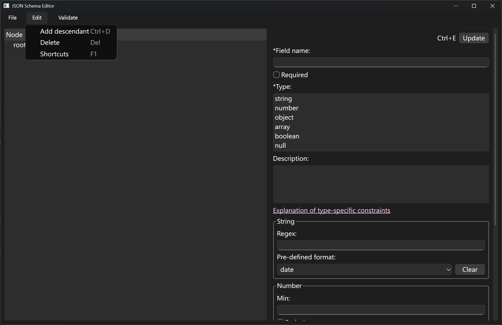

# JSON schema editor
GUI to edit JSON schema in draft-7 standard

## Usage

Shortcuts and symbol meanings:

-   Press `F1` or select `Edit -> Help` in the menu bar.

Functions in `Edit` menu:

-   Add child node to currently selected node
-   Delete a node
-   Open the help information

Functions in `Validate` menu:

-   Validate this schema
-   Select a data file and validate whether it fits this schema

To edit a node,, select it and its information will be expanded at the right column. Modify these information and click "Update" to save.

**If clicking (selecting) another node before clicking "Update" to save the current node, the modification will be lost.**

[Draft-7 JSON schema standard](https://json-schema.org/draft-07)

This JSON editor is compatible to [OpenAI structured output schema](https://platform.openai.com/docs/guides/structured-outputs?type-restrictions=string-restrictions#supported-schemas).

