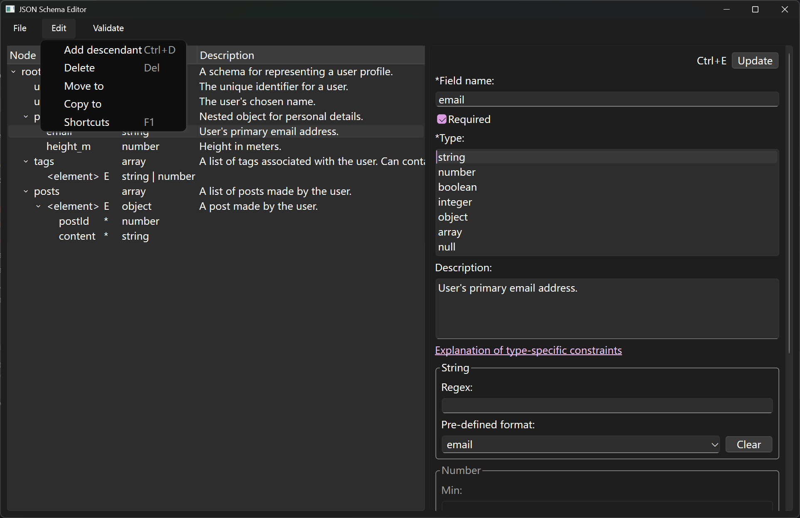

# JSON schema editor
JSON schema editor


## Install

### Terminal user

Download the latest release and unzip.

Execute `JSON Schema Editor.exe`.

### Compile from source

Create and activate a Python 3.13 virtual environment.

Run the following command in terminal.

```
pip install -r requirements.txt
pyinstaller main.spec
```

## Usage




> [!TIP]
>
> 1.   Save by clicking "Update" after making modification to any node.
> 2.   Use `Validate > Validate schema` to check the schema from time to time when editing, because the user is required to amend the schema until validated before saving.


This editor follows [Draft-7 JSON schema standard](https://json-schema.org/draft-07).

This editor can be used to generate [OpenAI structured output schema](https://platform.openai.com/docs/guides/structured-outputs?type-restrictions=string-restrictions#supported-schemas).

